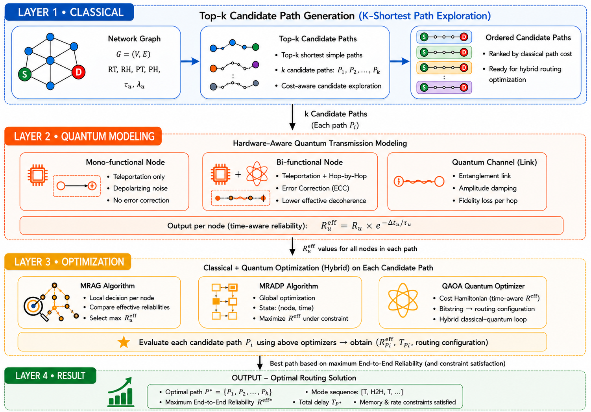

# Reliability-Aware Quantum Routing

Hybrid quantum routing optimization for heterogeneous quantum communication networks using MRAG, MRADP, and QAOA. The framework incorporates quantum memory lifetime, entanglement generation rate, and circuit-level reliability modeling to improve routing decisions under realistic quantum communication constraints.

## Overview

Quantum communication networks face challenges such as quantum memory decoherence, entanglement generation delays, and heterogeneous node capabilities. This project investigates reliability-aware hybrid routing strategies that combine quantum teleportation and hop-by-hop transmission using both classical and quantum optimization techniques.

## Key Features

* Hybrid transmission using Teleportation and Hop-by-Hop communication
* Circuit-level reliability modeling
* Quantum memory lifetime-aware routing optimization
* Entanglement generation rate-aware routing optimization
* Memory and Rate Aware Greedy (MRAG)
* Memory and Rate Aware Dynamic Programming (MRADP)
* QAOA-based routing optimization
* IBM Quantum hardware validation
* Shortest-path and Top-k candidate path routing

## Repository Structure

```text
Reliability-Aware-Quantum-Routing/
│
├── quantum_routing_shortest_path.ipynb
├── quantum_routing_top_k_paths.ipynb
├── README.md
│
└── figures/
```

## Routing Framework

The proposed framework combines:

1. Candidate path generation
2. Hardware-aware quantum transmission modeling
3. Reliability-aware routing optimization
4. Classical optimization using MRAG and MRADP
5. Quantum optimization using QAOA



## Notebook Descriptions

### quantum_routing_shortest_path.ipynb

Implements the routing framework using a single shortest path between source and destination nodes. Includes reliability evaluation under varying network conditions.

### quantum_routing_top_k_paths.ipynb

Extends the routing framework using Top-k candidate path exploration. Multiple routing alternatives are evaluated to identify globally reliable routing configurations.

## Technologies Used

* Python
* Qiskit
* IBM Quantum
* NetworkX
* NumPy
* Matplotlib

## Running the Project

1. Clone the repository
2. Open the notebooks in Google Colab or Jupyter Notebook
3. Install the required dependencies
4. Execute the notebooks sequentially
